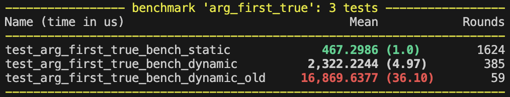
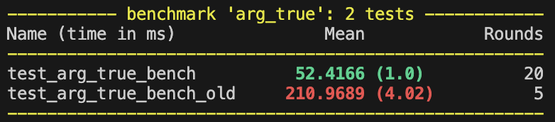
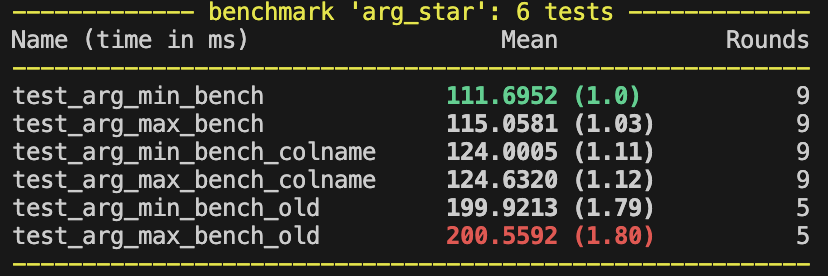
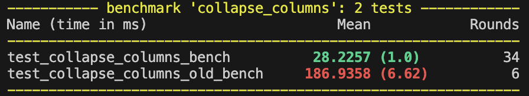

# pl-horizontal

A very small Polars plugin library providing horizontal operations on DataFrames. Library contains niche fast paths and shortcuts for more aggressive optimizations; useful when you know some information about your data that could be passed down.

---

### Motivation

Not all data is long, and not all data can be converted to long. Often times I deal with massively dimensional datasets that cannot be reasonably pivoted. This library is meant to deal with some of that.

I have only several functions that are hybrids of list/array operations with some little fast paths. This library is as much about performance in time as it is in memory.

## Installation

```bash
uv pip install pl-horizontal
```

## Features

- `collapse_columns`: Collapse multiple columns into a list column, optionally using a null-sentinel fast path.
- `arg_true_horizontal`: Check if any column in a row is True.
- `arg_first_true_horizontal`: Get the index of the first True value in a row.
- `arg_first_null_horizontal`: Get the index of the first null value in a row.
- `multi_index`: Get the value using an index on a lookup provided.
- `arg_max_horizontal`: Get the index (or column name) of the maximum value in a row.
- `arg_min_horizontal`: Get the index (or column name) of the minimum value in a row.
- `is_max`: Get a boolean mask of whether the value is the maximum, works with over/groupby.
- `is_min`: Get a boolean mask of whether the value is the minimum, works with over/groupby.

## Benchmarks and Performance

If there's a custom implementation, I will include benchmarks against the polars native way. For many functions, there are significant speedups and memory reductions.






## Usage

### Get the First Null Value

```python
import polars as pl
from pl_horizontal import arg_first_null_horizontal

df = pl.DataFrame({
    "a": [1, 2, None],
    "b": [3, None, 1],
    "c": [2, 1, 4]
})
# Get the index of the first null value per row
res = df.select(arg_first_null_horizontal(pl.all()))
print(res)
assert res.to_series().to_list() == [None, 1, 0]
```

### Get Min/Max Horizontally

```python
import polars as pl
from pl_horizontal import arg_max_horizontal

## Return the column name of the maximum value per row
df = pl.DataFrame({
    "a": [1, 2, None],
    "b": [3, None, 1],
    "c": [2, 1, 4]
})
res = df.select(arg_max_horizontal(pl.all(), return_colname=True))
print(res)
assert res.to_series().to_list() == ['b', 'a', 'c']
```

### Figure out which values are the max/min

```python
import polars as pl
from pl_horizontal import is_max, is_min
df = pl.DataFrame({
    "a": [1, 2, None],
    "b": [3, None, 1],
    "c": [2, 1, 4]
})
# Check which values are the max per row
res = df.select(is_max(pl.all()))
print(res)
```

### Collapse Columns into List

```python
import polars as pl
from pl_horizontal import collapse_columns

df = pl.DataFrame({
    "a": ["x", None, "z"],
    "b": ["y", "y2", None],
    "c": [None, "c2", "c3"]
})

# Normal collapse
res = df.select(f=collapse_columns(pl.col("a", "b", "c"), is_null_sentinel=False))
print(res)
assert res.to_series().to_list() == [['x', 'y'], ['y2','c2'], ['z','c3']]

# Fast path: nulls are guaranteed to be at the end
res_fast = df.select(f=collapse_columns(pl.col("a", "b", "c"), is_null_sentinel=True))
print(res_fast)
assert res_fast.to_series().to_list() == [['x','y'], [], ['z']]
```

### Horizontal Boolean Checks

```python
import polars as pl
from pl_horizontal import arg_true_horizontal, arg_first_true_horizontal

df = pl.DataFrame({
    "a": [True, False],
    "b": [False, True]
})

# Check if any value is True per row
res = df.select(arg_true_horizontal(pl.all()))
print(res)
assert res.to_series().to_list() == [[0], [1]]

# Index of first True value per row
df2 = pl.DataFrame({
    "a": [False, False],
    "b": [True, False],
    "c": [False, True]
})
res2 = df2.select(arg_first_true_horizontal(pl.all()))
print(res2)
assert res2.to_series().to_list() == [1, 2]
```

### Multi Index Lookup

```python
import polars as pl
from pl_horizontal import multi_index

ser = pl.Series(values=["hi", "how", "are", "you"])
df = pl.DataFrame({"foo": [0, 1, 2], "duchess": [None, 3, 0]})

expected = pl.DataFrame(
    {"foo": ["hi", "how", "are"], "duchess": [None, "you", "hi"]}
)

res = df.select(multi_index(pl.all(), lookup=ser))
print(res)
assert expected.equals(res)
```

## Contributing

This is a simple project, would welcome any rust people, since I'm very new to it!

I use UV religiously, so it's commands (sync, add, uvx, ...) should handle everything you need.

Run the suite with `make test`, run the linter with `make lint`, along with some other targets.
